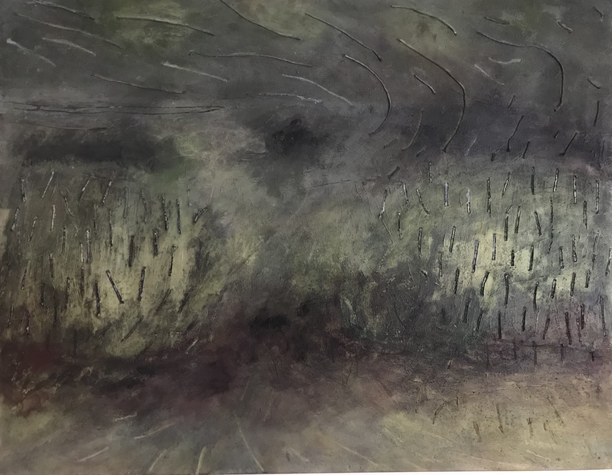

<!DOCTYPE html>
<!-- Sam Gainer 
    last modified 2/22/2021-->
<html lang="en US">
    <head>
        <link rel="stylesheet" type="text/css" href="samstyle.css">
        <link rel="stylesheet" href="https://cdnjs.cloudflare.com/ajax/libs/font-awesome/4.7.0/css/font-awesome.min.css">
        <title>MG Paintings | Home</title>
        <h1>Murray Gainer Paintings | Home</h1>
        
        

    
    </head>

    <body>
      
      
        

            <nav>
                <a href="mur.html">HOME</a>
                <a href="gallery.html">GALLERY</a>
                <a href="archive.html">ARCHIVE</a>
                <a href="about.html">ABOUT</a>
                <a href="contact.html">CONTACT US</a>
            </nav>
        

    
  Greetings;  this is a web page dedicated to the artwork of Murray Gainer.

    
  Enjoy your visit; Use the top menu to navigate the page.  

        
          

        

<!-- Slideshow container -->

  <!-- Full-width images with number and caption text -->
  

    
1 / 22

    
    
Gainer, Murray. <em>Untitled.</em> 2020. Acrylic on canvas. [36" x 28"]

  

  

    
2 / 22

    
    
Gainer, Murray. <em>Untitled.</em> 2020. Acrylic on canvas. [36" x 28"]

  

  

    
3 / 22

    
    
Gainer, Murray. <em>Untitled.</em> 2020. Acrylic on canvas. [36" x 28"]

  

  

    
4 / 22

    
    
Gainer, Murray. <em>Untitled.</em> 2020. Acrylic on canvas. [36" x 28"]

  

  

    
5 / 22

    
    
Gainer, Murray. <em>Untitled.</em> 2020. Acrylic on canvas. [36" x 28"]

  

  

    
6 / 22

    
    
Gainer, Murray. <em>Untitled.</em> 2020. Acrylic on canvas. [36" x 28"]

  

  

    
7 / 22

    
    
Gainer, Murray. <em>Untitled.</em> 2020. Acrylic on canvas. [36" x 28"]

  

  

    
8 / 22

    
    
Gainer, Murray. <em>Untitled.</em> 2020. Acrylic on canvas. [36" x 28"]

  

  

    
9 / 22

    
    
Gainer, Murray. <em>Untitled.</em> 2020. Acrylic on canvas. [36" x 28"]

  

  

    
10 / 22

    
    
Gainer, Murray. <em>Untitled.</em> 2020. Acrylic on canvas. [36" x 28"]

  

  

    
11 / 22

    
    
Gainer, Murray. <em>Untitled.</em> 2020. Acrylic on canvas. [36" x 28"]

  

  

    
12 / 22

    
    
Gainer, Murray. <em>Untitled.</em> 2020. Acrylic on canvas. [36" x 28"]

  

  

    
13 / 22

    
    
Gainer, Murray. <em>Untitled.</em> 2020. Acrylic on canvas. [36" x 28"]

  

  

    
14 / 22

    
    
Gainer, Murray. <em>Untitled.</em> 2020. Acrylic on canvas. [36" x 28"]

  

  

    
15 / 22

    
    
Gainer, Murray. <em>Untitled.</em> 2020. Acrylic on canvas. [36" x 28"]

  

  

    
16 / 22

    
    
Gainer, Murray. <em>Untitled.</em> 2020. Acrylic on canvas. [36" x 28"]

  

  

    
17 / 22

    
    
Gainer, Murray. <em>Untitled.</em> 2020. Acrylic on canvas. [36" x 28"]

  

  
  

    
18 / 22

    
    
Gainer, Murray. <em>Untitled.</em> 2020. Acrylic on canvas. [36" x 28"]

  

  

    
19 / 22

    
    
Gainer, Murray. <em>Untitled.</em> 2020. Acrylic on canvas. [36" x 28"]

  

  

    
20 / 22

    
    
Gainer, Murray. <em>Untitled.</em> 2020. Acrylic on canvas. [36" x 28"]

  

  

    
21 / 22

    
    
Gainer, Murray. <em>Untitled.</em> 2020. Acrylic on canvas. [36" x 28"]

  

  

    
22 / 22

    
    
Gainer, Murray. <em>Untitled.</em> 2020. Acrylic on canvas. [36" x 28"]

  

  <!-- Next and previous buttons -->
  <a class="prev" onclick="plusSlides(-1)">&#10094;</a>
  <a class="next" onclick="plusSlides(1)">&#10095;</a>

 

 
  </body>
      

   <address>Web page created by Sam Gainer   Last updated 2/22/2021</address>

</html>
